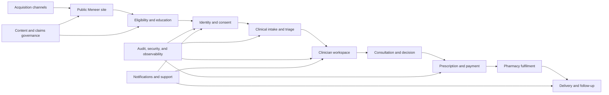

# Meneer Master Blueprint v1

## Document Status

- **Status:** Initial planning baseline
- **Date:** 2026-08-05
- **Last amended:** 2026-08-08
- **Scope:** Product, clinical operations, platform architecture, governance, and delivery
- **Current implementation:** Lovable-origin TanStack Start v1 MVP with repository-owned Cloudflare
  configuration; `itws-I-preview` temporarily remains the Cloudflare production branch serving
  `meneerhealth.co.za`, while `itws-I` is the permanent source boundary
- **Purpose:** Define the intended destination before further feature development begins

## Executive Vision

Meneer is intended to become a South African direct-to-consumer men's health service that removes the embarrassment, inconvenience, and uncertainty that prevent men from seeking care. The experience should combine a discreet premium brand with clinically governed telehealth: private digital intake, consultation with an HPCSA-registered clinician, prescriptions where appropriate, pharmacy fulfilment, and neutral delivery.

The current repository proves the acquisition concept and visual direction. It does not yet implement the patient, clinical, pharmacy, fulfilment, or compliance systems implied by the interface. The next stage must convert that promise into an auditable operating platform without weakening the direct, human tone that differentiates Meneer.

## Platform Evolution Strategy

Meneer will evolve through deliberate product generations rather than treating each framework change as a clean rewrite:

1. **v1 — TanStack Start pilot:** remove Lovable coupling, explicitly own and verify the Cloudflare runtime, stabilise the experience, and operate a controlled one-month pilot with a test client group. v1 must not imply that unimplemented clinical or operational actions occurred.
2. **v2 — Next.js public launch:** absorb validated v1 journeys, language, analytics, domain rules, data contracts, and test cases; correct pilot findings; and deliver the first public-launch architecture.
3. **v3 — Laravel API and React:** introduce a mature service backend when real user volume, client operations, integrations, or organisational scale justify it. Preserve compatible contracts and migrate data through rehearsed, reversible procedures.

Frameworks are replaceable delivery shells. The durable product consists of the domain model, approved content, workflow states, API contracts, database schema, audit events, security rules, migration history, and acceptance tests. Every generation must demonstrate behavioural equivalence for retained capabilities and document intentional improvements or removals.

DR-004 makes that portability enforceable through a canonical contract catalogue for commands,
queries, results, events, errors, and audit facts. Contract majors, runtime validation, idempotency,
concurrency, safe errors, reconciliation, compatibility, cutover, and rollback rules survive each
framework generation; generated types and framework handlers are adapters only.

After Sprint 01 comparison, the repository owner selected Cloudflare for the TanStack v1 pilot. Vercel remains a possible host for the planned Next.js v2 and is not a v1 dependency. Platform-specific services may support deployment, previews, functions, logs, and assets, but core patient and clinical data must remain portable and platform services must not become the only expression of clinical rules or authoritative workflow state.

The v1 release contract is documented in
`docs/06-operations/cloudflare-environments-release-runbook.md`. The repository pins its Bun and
Node build boundary, keeps browser-visible variables separate from server secrets, uses immutable
Worker versions for review and rollback, and reserves Git pushes, production promotion, and
rollback for the repository owner. The temporary preview-video branch mapping must not be mistaken
for the permanent source of truth. Sprint 02 verified canonical SSR, hydration, routes, assets,
logs, rollback availability, and pinned Cloudflare production/non-production builds. Cloudflare
Fonts and automatic Web Analytics remain disabled for the pilot. TD-052 is Verified.

## Product Thesis

### Target users

- Adult men in South Africa seeking help with hair loss, erectile dysfunction, weight management, testosterone concerns, and potentially peptides.
- Men who value privacy, convenience, transparent clinical guidance, and home delivery.
- Clinicians who need safe, structured information before and during a consultation.
- Operations staff coordinating eligibility, appointments, prescriptions, pharmacy hand-offs, and delivery exceptions.

### Core value proposition

Meneer should make legitimate healthcare easier to start and simpler to complete. It is not merely an online medication storefront. Clinical independence, eligibility screening, informed consent, continuity of care, and the ability to decline inappropriate treatment are core product behaviour.

### Product principles

1. **Clinical safety before conversion:** no sales objective overrides clinician judgement.
2. **Privacy by design:** collect only necessary data and make every disclosure intentional.
3. **No false completion:** confirmation is shown only after a durable backend transaction succeeds.
4. **Plain language:** direct, respectful copy without trivialising risk or overstating outcomes.
5. **One source of truth:** treatments, timelines, pricing, claims, and policies stay consistent across the website, MCP, messages, and operational tools.
6. **Human accountability:** patients can identify the responsible provider and reach a real support channel.
7. **Migration by absorption:** later versions preserve proven behaviour and evidence while improving weaknesses discovered in the previous version.
8. **Portable core:** business rules and health records must not depend irreversibly on Lovable, Vercel, TanStack, Next.js, or Laravel conventions.

## Intended End-to-End Journey

1. **Discover:** visitor arrives through organic search, campaign, referral, poster QR code, or an AI/MCP client.
2. **Understand:** condition education explains benefits, limits, risks, pricing, eligibility, and the clinical process.
3. **Pre-screen:** the visitor selects a concern and completes an age, location, urgency, and contraindication screen.
4. **Consent:** the platform records the exact approved privacy notice, consent version, timestamp, and withdrawal route.
5. **Identity and account:** the patient verifies contact details and creates or accesses a secure account.
6. **Clinical intake:** a versioned, condition-specific questionnaire captures medical history, medication, symptoms, and relevant measurements.
7. **Triage:** rules identify emergencies, exclusions, missing information, laboratory requirements, and suitable consultation pathways.

/_ +++ OLD STEP 8 and 9 +++ 8. **Consult:** an authorised clinician reviews the record and conducts the required video or telephone consultation. 9. **Clinical decision:** the clinician records assessment, treatment decision, follow-up plan, and prescription where appropriate.
_/

8. **Required review:** the workflow routes the patient to the approved decision authority for that
   condition. The intended peptide route is a Precise Wellness questionnaire and dispensing decision;
   testosterone and other applicable treatments require authorised clinician review and consultation.
9. **Treatment decision:** the accountable authority records the assessment or questionnaire outcome,
   treatment decision, exclusions, escalation, follow-up plan, and prescription where applicable.
10. **Payment and fulfilment:** approved commercial paths support consultation-only, medication
    plus delivery, or an approved bundle. Payment, clinical approval, supply, hub receipt, dispatch,
    delivery, refund, and cancellation remain separate durable states.
11. **Ongoing care:** the patient receives follow-up prompts, monitoring, repeat-consult requirements, support, and cancellation options.

No later stage may be implied as complete when an earlier durable transaction has failed.

## Target Platform Boundaries

DR-003 is the authoritative logical-boundary decision for this target. It approves channel-specific
interfaces over an application/API boundary and a framework-neutral modular core. v1 may implement
that design as one deployable modular application; route files, browser state, framework APIs, and
external-provider callbacks are not authoritative workflow records. Physical services may be
separated only when evidence justifies the added operational cost.

DR-004 governs communication across these boundaries. Modules exchange versioned commands,
purpose-limited queries, committed domain events, safe errors, and audit facts rather than sharing
framework state or private persistence. Migrations expand compatible contracts, move and reconcile
data/consumers, cut over one authority at a time, observe, and only then remove the old path.

### Public acquisition layer

Owns landing pages, treatment education, campaign routes, SEO, approved claims, FAQs, contact channels, and public MCP information. It must never expose private clinical data.

### Patient application

Owns identity, profile, contact verification, consent, intake, appointments, secure messages, orders, delivery status, documents, and account rights. Authentication and authorisation must be server-enforced.

### Clinical workspace

Owns queues, intake review, consultation notes, clinical decisions, prescriptions, follow-up schedules, and clinician audit trails. Roles and scopes must prevent operations staff from exercising clinical authority.

### Operations workspace

Owns non-clinical support, appointment coordination, payment exceptions, pharmacy hand-offs, delivery tracking, refunds, and escalation. Sensitive fields should be masked unless required for the role.

### Integration layer

Provides controlled adapters for identity, messaging, video consultations, laboratories, payments, pharmacy, courier, email, WhatsApp, and observability. External failures require retry, reconciliation, and manual recovery paths.

## Data and Security Model

The platform should classify data before selecting storage or vendors:

- **Public:** approved marketing and treatment information.
- **Account:** identity and contact information.
- **Special personal information:** health history, symptoms, medication, laboratory results, consultation records, and prescriptions.
- **Operational:** payments, fulfilment, delivery, support, and reconciliation data.
- **Security and audit:** authentication events, access decisions, consent versions, administrative changes, and incident evidence.

Required controls include encryption in transit and at rest, least-privilege access, MFA for privileged users, secure session management, rate limiting, abuse protection, immutable audit events, backup and restore testing, retention schedules, deletion/anonymisation workflows, incident response, and vendor/data-processing review.

Passwords must never be managed as ordinary application fields. Use a proven identity provider or a deliberately designed authentication service. Sensitive values must not be logged, embedded in analytics, exposed to MCP tools, or sent to third parties without an approved purpose.

## Clinical and Content Governance

Before publishing treatment claims or collecting patient data, named clinical and legal owners must approve:

- Provider identity, registrations, service territory, and escalation channels.
- Treatment scope, inclusion/exclusion criteria, contraindications, and emergency redirection.
- Consent, privacy, terms, data-subject rights, retention, and withdrawal language.
- Pricing, refunds, consultation charges, subscriptions, and cancellation rules.
- Delivery promises and pharmacy responsibilities.
- Condition education, expected outcomes, adverse effects, and follow-up requirements.
- All peptide positioning, programme purpose, exact products, sourcing, Precise Wellness questionnaire
  and dispensing model, product-level registration/scheduling or other legal basis, escalation, and
  regulatory wording.

Approved copy should be versioned and referenced by website pages, questionnaires, messages, and MCP responses rather than duplicated ad hoc.

## MCP Strategy

MCP is optional and is not required for the v1 pilot. Sprint 02 removed the Lovable MCP SDK,
manifest, tools, OAuth metadata, and public routes. A future implementation requires a named use
case, separate approval, and a vendor-neutral boundary on the selected host.

If retained, its scope must remain read-only and limited to approved public content:

- Organisation overview and verified trust markers.
- Current treatment categories and availability.
- Patient journey, support routes, and published policies.

MCP responses must draw from the same governed content source as the website. No patient, clinician, account, scheduling, or order tools should be exposed until authentication, authorisation, consent, rate limiting, audit logging, and threat modelling are complete.

No `LOVABLE_API_KEY` should be provisioned on the selected host. The former Lovable telemetry path
is removed and hosted browser-network/log verification finds no remaining Lovable request.

## Non-Functional Requirements

- Responsive and keyboard-accessible WCAG-oriented experiences.
- Server-side validation for every state-changing request.
- Idempotency for account, consent, booking, payment, and order operations.
- Explicit loading, retry, failure, and support states.
- Structured logs without health or credential payloads.
- Error monitoring, uptime checks, service-level objectives, and operational alerts.
- Automated unit, integration, accessibility, security, and critical-path browser tests.
- Reproducible Bun installs, passing lint/type/build gates, dependency review, and CI-controlled deployment.
- Environment separation for local, preview, staging, and production.
- Rollback and data-migration procedures before production releases.

## Delivery Programme

### Phase 0 — Stabilise and de-platform v1

Replace the Lovable Vite wrapper, virtual assets, branding, MCP telemetry/manifest, and generated platform routes. Decide the v1 host, remove configuration that is obsolete for that choice, and configure a standard supported TanStack Start deployment. Correct broken assets and metadata; remove or gate incomplete funnels; resolve lint failures; triage vulnerable dependencies; establish documentation, CI, security headers, environment conventions, and ownership. No health-information collection should occur in this phase.

### Phase 1 — Confirm the v1 pilot operating model

Define exactly which journeys the test group will use and whether each is functional, manually operated, waitlisted, or demonstrative. Approve the participating entity, clinician/support responsibilities, consent basis, data map, policies, treatment claims, peptide disposition, success measures, incident response, and exit criteria. Produce reviewed pilot journey maps and acceptance criteria.

### Phase 2 — Implement the minimum safe v1 pilot

Implement only the approved pilot scope, including real registration, intake, approved clinical
handling, payment, order, supply, hub dispatch, delivery, and support where enabled. Every submission
must have server validation, a durable monitored destination, appropriate access control, versioned
consent where required, privacy-safe logs, a support/recovery path, and an end-to-end test. Any
capability that cannot meet this boundary must be removed, gated, or clearly presented as a waitlist.

### Phase 3 — Run the controlled v1 pilot

Run the time-boxed pilot with the approved test group only after the pilot gate is met. Capture usability, trust, support, operational, safety, and conversion findings without presenting unfinished workflows as complete. Monitor incidents and stop or narrow the pilot if an approved safety or privacy threshold is crossed.

### Phase 4 — Consolidate v1 learning

Classify findings as retain, improve, remove, or defer. Freeze the validated journeys, terminology, domain rules, content decisions, fixtures, data contracts, and acceptance tests that v2 must absorb. Produce a migration plan and reconcile or securely dispose of pilot data under the approved policy.

### Phase 5 — Build the Next.js patient and clinical foundation

Implement identity, verified contact methods, consent records, patient profiles, authorisation, audit logging, secure storage, account rights, versioned questionnaires, triage rules, clinician queues, consultations, decision records, laboratory workflows, and follow-up plans. Prove retained v1 behaviour with cross-generation acceptance tests.

### Phase 6 — Expand commerce and fulfilment

Absorb the validated v1 pricing, Stripe payment, prescription, Precise Wellness supply, Meneer hub,
delivery, refund, reconciliation, notification, and exception contracts into v2. Expand automation
only where pilot evidence justifies it, and rehearse retries, partial failures, manual recovery, and
financial/fulfilment reconciliation.

### Phase 7 — Next.js public launch

Complete security and privacy review, disaster-recovery exercise, accessibility audit, performance testing, content sign-off, operational training, support rehearsals, and staged production rollout with monitored conversion and clinical-safety metrics.

### Phase 8 — Scale-triggered Laravel and React evolution

Consider Laravel and React only when measured demand, multi-client operations, complex integrations, team structure, or scaling economics justify the migration. Approve it through an architecture decision, preserve API and data contracts where sound, rehearse migrations and rollback, and prove retained journeys against cross-version acceptance tests.

## Launch Gates

### Controlled v1 pilot gate

The pilot may begin only when its exact participant scope, operator workflow, consent basis, support channel, data handling, incident response, and honest interface wording are approved. Every enabled submission must reach a durable, monitored destination; otherwise the route must remain non-transactional. Lovable and obsolete platform coupling must be removed, and the selected host's preview-to-production deployment must be verified.

### Public-launch gate

The service is not ready for public launch until all of the following are evidenced:

- Approved legal, privacy, consent, clinical, and marketing content.
- Real provider, pharmacy, fulfilment, and support arrangements.
- Successful secure account, intake, consultation, decision, payment, and delivery workflows.
- Documented data inventory, access model, retention, incident response, and vendor review.
- Passing lint, type, build, tests, vulnerability thresholds, and browser checks.
- No placeholder destinations, videos, QR codes, policies, contact details, or false success states.
- Production monitoring, alerts, backups, recovery, audit trails, and accountable owners.

## Decisions Required Before Detailed Implementation Planning

DR-001 approves a layered boundary: Meneer Health is the working customer-facing brand, OCTOTHORP
ZA owns technology, marketing, general support, and operations coordination, and verified
independent clinical and pharmacy parties retain professional authority. DR-008 establishes the
accountable approval roles. The remaining decisions are:

1. Which legal entity contracts with the patient for each component and controls each data category?
2. Which clinicians, pharmacies, laboratories, couriers, and peptide-partner authorities are approved?
3. Which treatments launch first, and which remain informational or waitlisted?
4. What consultation, prescription, payment, subscription, cancellation, and refund models apply?
5. Which authentication, database, scheduling, messaging, payment, and observability vendors are acceptable?
6. What are the authoritative clinical pathways and escalation rules per condition?
7. Which private role holders satisfy the DR-008 clinical, privacy, security, operations, content,
   data, and release approval roles?
8. Which v1 workflows are in the controlled pilot, and which are demonstrations, waitlisted, or removed?
9. Which measured thresholds would justify the Next.js and later Laravel/React migrations?
10. Which database and service providers meet portability, POPIA, residency, security, and operational requirements?

## Market Reference Position

Meneer aims to develop the breadth and convenience associated with direct-to-consumer platforms such as Hims and Ro while competing directly in South Africa with providers such as AndroLab. These companies are experience and market references, not sources of automatically approved claims, clinical pathways, pricing, or legal language. Meneer must differentiate through locally appropriate care, accountable providers, privacy, operational reliability, and South African regulatory review.

## Repository Governance

Future work should be planned in small, reviewable implementation documents. Each implementation must identify the user outcome, data classification, security and clinical implications, dependencies, migrations, tests, rollback path, and evidence required for completion. Generated files should remain tool-owned, dependency changes should be deliberate, and no release should bypass the agreed validation gates.

Migration work must additionally identify the source-version behaviour, destination-version behaviour, retained contracts, intentional changes, data migration, compatibility tests, cutover, rollback, and post-migration reconciliation evidence.
