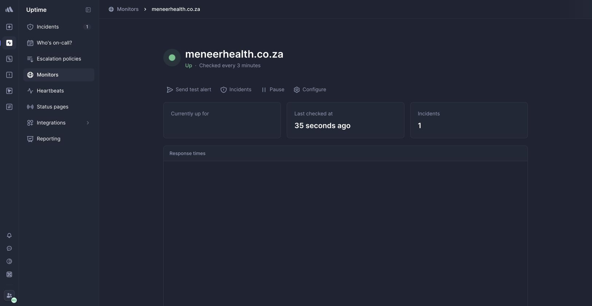

# Sprint 05.18 — Better Stack Uptime Evidence

## Outcome

The owner-authorised Better Stack Free activation now monitors the canonical public homepage and
has passed a controlled incident exercise. Better Stack receives only the public URL, status and
timing. No identity, contact, query string, header, token, request body, clinical data, provider
payload or application log source was connected.

Monitor `4799009`, activated on 11 August 2026, is configured for
`https://meneerhealth.co.za/` with:

- an explicit HTTP success allowlist of `200`–`208`;
- a three-minute check frequency and three-minute failure-confirmation period;
- TLS verification, redirect following and IPv4/IPv6 checks from all available regions;
- email notification to the company-controlled operations channel; and
- escalation to the whole free-tier team after three unacknowledged minutes.

The permanent policy was restored after the exercise and the monitor was observed **Up**.

## Controlled Incident Evidence

The exercise used a temporary expected-status mismatch against the public homepage. It did not
degrade or change the deployed website and transmitted no private data.

| Provider event                          | SAST timestamp           | Result                              |
| --------------------------------------- | ------------------------ | ----------------------------------- |
| First failed check entered confirmation | 11 Aug 2026, 17:40:27    | Incident held pending               |
| Incident opened and email sent          | 11 Aug 2026, 17:43:28    | Confirmed after three minutes       |
| Owner acknowledged incident             | 11 Aug 2026, 17:44:44    | 76 seconds; within 15-minute target |
| Healthy regional checks resumed         | 11 Aug 2026, 17:46:13–17 | Recovery validation began           |
| Incident automatically resolved         | 11 Aug 2026, 17:49:23    | Three-minute recovery window passed |

Provider incident `1000271634` remains as the durable Better Stack record. The unrelated
`octothorp.co.za` sample incident and onboarding telemetry are provider demonstration content and
are not Meneer evidence.

## Scope and Residual Gates

Task 5.18 completes the hosted public-uptime-monitor and incident-response portion of TD-020. It
does not create a Better Stack backup heartbeat, private EU R2 bucket, hosted Stripe webhook,
partner callback, application-log drain or customer journey. TD-020 therefore remains **In
progress** until those separately assigned hosted integrations are provisioned and fail-tested.
