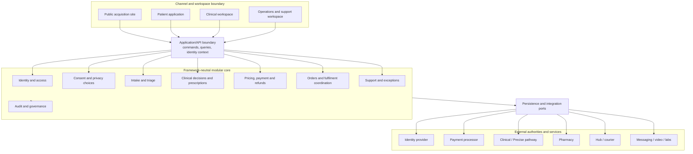
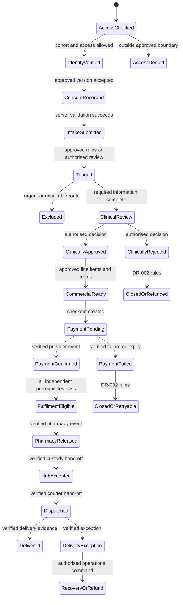

# DR-003 — Platform Boundaries and Authoritative State

## Context and Scope

The current v1 repository is one TanStack Start application deployed through a Cloudflare Worker.
It renders public pages, gated campaign/start/peptide routes, and static assets. It has no live
application API, authentication service, datastore, durable workflow state, clinical workspace,
operations workspace, or transactional integration.

This record defines the logical boundaries and state ownership that transactional implementation
must follow. It does not select a database, identity provider, deployment topology, or integration
vendor; those decisions belong to DR-005–DR-007. It also does not define the versioned payloads and
events assigned to DR-004.

### Confirmed Constraints

- Cloudflare remains the approved TanStack v1 host; Next.js is the intended v2 generation and a
  Laravel API plus React remains conditional v3.
- Later generations absorb validated behaviour, states, data, contracts, tests, and evidence.
- Client component state, route files, URL navigation, and success pages are never authoritative
  workflow records.
- Clinical authority remains separate from technology, marketing, commercial, and operations
  authority under DR-001.
- Clinical, payment, order, pharmacy, custody, delivery, cancellation, refund, and support states
  remain separate under DR-002.
- The transactional pilot remains disabled until its complete activation gate passes.

### Explicit Unknowns

- `[TBC — owner: DATA OWNER — gate: DR-005 approval]`: datastore, schemas, tenancy, lifecycle,
  backup, and migration implementation.
- `[TBC — owner: SECURITY OWNER — gate: DR-007 approval]`: identity provider, roles, sessions,
  service identities, permissions, and privileged access.
- `[TBC — owner: ARCHITECTURE OWNER — gate: DR-004 approval]`: concrete command, query, API, event,
  versioning, validation, idempotency, and compatibility contracts.
- `[TBC — owner: RELEASE OWNER — gate: Sprint 05 implementation]`: physical v1 module mapping,
  enabled endpoints, environment bindings, monitoring, reconciliation, and recovery evidence.

## Options Considered

| Option                                                           | Benefits                                                           | Costs and risks                                                                   | Disposition |
| ---------------------------------------------------------------- | ------------------------------------------------------------------ | --------------------------------------------------------------------------------- | ----------- |
| Keep workflow rules and state inside React/routes                | Fast prototype changes                                             | False success, duplicated rules, weak testing, and framework lock-in              | Rejected    |
| Create independent microservices immediately                     | Strong physical separation                                         | Excessive v1 complexity, distributed failure modes, and premature operations cost | Rejected    |
| Begin with a modular application and explicit logical boundaries | Low v1 overhead with portable ownership and later extraction paths | Requires discipline and boundary tests inside one deployment                      | Approved    |

## Decision

Meneer uses a **framework-neutral modular core** behind channel-specific interfaces. v1 may deploy
the modules together in one Cloudflare-compatible application. Logical ownership, APIs, events,
permissions, migrations, and tests must remain explicit even while the deployment is monolithic.
No module may read another module's private persistence directly or infer its state from UI output.

The arrows represent allowed interaction, not a shared database or authority transfer. Every
channel accesses state through authenticated, authorised application commands and queries.

## Boundary Responsibilities

| Boundary                     | Owns                                                                                                     | Must not own or infer                                                                    |
| ---------------------------- | -------------------------------------------------------------------------------------------------------- | ---------------------------------------------------------------------------------------- |
| Public acquisition           | Approved content, campaigns, public policies, metadata and non-sensitive support entry                   | Accounts, consent, health intake, clinical state, payment/order state or private records |
| Patient application          | Authenticated views and commands for profile, consent, intake, appointments, messages, orders and rights | Authoritative state in browser storage or permission decisions in components             |
| Clinical workspace           | Authorised queues and interfaces for clinical review, decisions, prescriptions and follow-up             | Commercial overrides, general administration, or unrelated patient records               |
| Operations/support workspace | Scheduling, non-clinical support, payment/order exceptions, hand-offs and delivery coordination          | Diagnosis, prescribing, dispensing authority, or unrestricted clinical content           |
| Application/API boundary     | Identity context, server validation, authorisation, orchestration, command/query routing and safe errors | Domain truth encoded only in framework routes or client-provided status                  |
| Modular core                 | Invariants, state machines, ownership, commands, events and framework-neutral policy                     | Provider SDK objects, UI components, HTTP details or host-specific environment access    |
| Persistence ports            | Durable repositories, transactions, migrations, concurrency and retrieval contracts                      | Vendor-specific semantics leaking into domain rules                                      |
| Integration ports/adapters   | Verification, mapping, retries, idempotency, timeouts, reconciliation and redaction                      | Allowing external callbacks or browser redirects to mutate unrelated state directly      |
| Audit/governance             | Append-only decision/access/change evidence and correlation                                              | Raw unnecessary health payloads, secrets, mutable business records or analytics profiles |

## Layering Rules

1. Channels render projections and submit intent; they never submit an authoritative status.
2. Application services authenticate the actor, authorise the resource/action, validate a versioned
   command, and call the owning domain module.
3. One domain module owns each state transition and invariant. Cross-domain progress uses an
   approved command/event contract rather than direct table writes.
4. Persistence and provider SDKs sit behind ports. Domain code must be testable without React,
   TanStack, Next.js, Laravel, Cloudflare, Vercel, Stripe, or a chosen database.
5. Queries may compose safe projections, but composition does not transfer write authority.
6. Every accepted or rejected state-changing command produces a traceable outcome and applicable
   audit evidence. Failure never renders success.
7. Manual correction uses an authorised compensating command; history is not overwritten.

## Authoritative-State Model

“Source evidence” is not always the same as “Meneer workflow authority.” For example, Stripe is the
source of a processor event, while the Commerce module owns the validated internal payment record
and whether that event satisfies a business prerequisite. A clinician owns clinical content; the
Clinical module preserves the signed/attributed record and exposes only permitted workflow facts.

| State domain                  | Authoring/source authority                                 | Meneer system-of-record owner                                                         | Permitted transition authority                                       | Consumers receive                                         |
| ----------------------------- | ---------------------------------------------------------- | ------------------------------------------------------------------------------------- | -------------------------------------------------------------------- | --------------------------------------------------------- |
| Cohort/access eligibility     | Approved roster and pilot policy                           | Identity/access module                                                                | Access owner through server command                                  | Allow/deny and safe reason code                           |
| Identity and verified contact | Identity provider evidence plus patient input              | Identity/access module                                                                | Patient or privileged identity process                               | Subject identifier and verified contact claims            |
| Consent/privacy choices       | Patient action against approved version                    | Consent module                                                                        | Patient; authorised privacy process for withdrawal/correction        | Consent fact, purposes, version and status                |
| Clinical intake               | Patient responses and approved questionnaire               | Intake module                                                                         | Patient before lock; authorised correction workflow after submission | Versioned intake status and permitted projection          |
| Triage                        | Approved rules and authorised reviewer                     | Intake/triage module                                                                  | Triage service or authorised clinical role                           | Routing, exclusion, urgency and missing-information facts |
| Clinical decision             | Authorised clinician or approved Precise pathway authority | Clinical module                                                                       | Attributed authorised professional only                              | Decision status and minimum permitted fulfilment facts    |
| Prescription                  | Authorised prescriber                                      | Clinical module                                                                       | Prescriber and approved amendment/revocation workflow                | Validity/reference and pharmacy-permitted details         |
| Price/charge definition       | Approved commercial catalogue                              | Commerce module                                                                       | Commercial owner through governed version change                     | Versioned payable line items                              |
| Processor payment             | Verified payment-provider event                            | Commerce ledger                                                                       | Commerce module after signature, amount and replay validation        | Internal payment status and opaque reference              |
| Refund/dispute                | Payment provider plus approved commercial command          | Commerce ledger                                                                       | Commercial owner/service under DR-002 rules                          | Refund/dispute status without clinical detail             |
| Order                         | Approved line items and patient acceptance                 | Order module                                                                          | Order service after clinical/commercial prerequisites                | Order state and safe reason codes                         |
| Pharmacy/dispensing           | Verified pharmacy professional/system                      | Order/fulfilment module stores normalised evidence; pharmacy owns professional record | Pharmacy authority through verified adapter                          | Release/rejection fact and minimum fulfilment data        |
| Hub inventory/custody         | Verified hub scan/acceptance                               | Fulfilment module                                                                     | Operations role or verified adapter                                  | Custody state, quantity and exception code                |
| Delivery                      | Verified courier event and recipient evidence              | Fulfilment module                                                                     | Verified adapter or authorised operations correction                 | Delivery state, timestamps and safe tracking projection   |
| Support case                  | Patient/support interaction                                | Support module                                                                        | Patient or authorised support/clinical escalation role               | Case status and role-filtered messages                    |
| Audit event                   | Owning module/application security decision                | Audit module                                                                          | Append only through approved audit interface                         | Authorised review projection only                         |
| Public content/claim          | Approved canonical content record                          | Content/governance boundary                                                           | Content owner after required domain approvals                        | Published version and channel scope                       |

## Core Workflow and Ownership

This diagram is an ownership view, not one aggregate status field. Each transition updates only its
owning module. Cross-domain prerequisites are evaluated from durable facts and preserve their
individual histories.

## Transition and Reconciliation Rules

- A command is accepted only by the module that owns the target transition and only from an
  authorised actor or verified service identity.
- Preconditions are evaluated server-side against current durable versions. Stale, duplicate,
  impossible, out-of-order, replayed, or unauthorised transitions fail safely.
- Cross-domain operations use a transaction when one datastore boundary can guarantee atomicity;
  otherwise they use idempotent events, pending states, retries, and reconciliation.
- External callbacks first enter an integration inbox. Signature, origin, schema, environment,
  replay, amount/reference, and idempotency checks precede domain handling.
- A browser redirect may prompt a query; it cannot confirm payment, clinical approval, dispensing,
  or delivery.
- Unknown or conflicting external state moves the affected workflow to `pending_reconciliation` or
  a domain-specific exception. It never guesses success.
- Manual recovery records actor, reason, previous/current state, evidence, correlation identifier,
  and any compensating action.

## Deployment Mapping

| Generation                   | Approved mapping                                                                                                                                                                                                                |
| ---------------------------- | ------------------------------------------------------------------------------------------------------------------------------------------------------------------------------------------------------------------------------- |
| v1 TanStack/Cloudflare       | One deployable modular application is acceptable. Keep UI/routes, application services, domain modules, ports/adapters and migrations in explicit directories with dependency rules and tests.                                  |
| v2 Next.js                   | Replace channel and application delivery where useful while absorbing the same domain ownership, state, contracts, persistence history and acceptance tests. Next.js routes/actions must not become the only domain definition. |
| Conditional v3 Laravel/React | Laravel may implement the application/domain API and React the channels when measured scale warrants it. Split physical services only for evidenced ownership, scaling, security or operational needs.                          |

A framework migration changes delivery mechanisms, not record meaning or authority. DR-004 defines
compatibility and migration contracts; DR-005 defines schema and data migration ownership.

## Security, Privacy, and Clinical Boundaries

- Public and authenticated caches, cookies, logs, errors, analytics, and indexes remain separate.
- Every query and command enforces actor, tenant/client, purpose, resource, action, and field scope
  server-side; UI hiding is not authorisation.
- Workspaces receive purpose-limited projections. Operations cannot browse clinical records merely
  because both tools share a deployment.
- External partners receive the minimum approved fields and their responses are attributed to a
  service/professional identity.
- Audit correlation spans modules without copying clinical payloads into logs, payments, or
  operational events.
- An unavailable safety-critical module or integration fails closed and exposes the approved
  support/escalation route.

## Rationale

A logical modular architecture is sufficient for the controlled v1 scale while preventing today’s
framework from becoming the product definition. It supports transactional safety, independent
clinical authority, clear operations, and later extraction without imposing premature distributed
systems complexity.

## Consequences and Risks

- Sprint 05 implementation must introduce real server/domain/persistence boundaries; this decision
  does not make the current public application transactional.
- A modular monolith can decay into shared-table coupling without dependency rules and tests.
- External providers remain evidence sources, not unrestricted writers to internal state.
- Denormalised read projections are allowed, but their source version and refresh/reconciliation
  behaviour must be explicit.
- Physical service separation requires a later superseding/topology decision and operational proof.

## Domain Implications

| Domain                             | Required treatment or approval                                                                    |
| ---------------------------------- | ------------------------------------------------------------------------------------------------- |
| Clinical and safety                | Clinical module and authorised professional own decisions; other domains consume minimum facts    |
| Legal and privacy                  | Patient, clinical, operations and partner projections follow approved purpose/data roles          |
| Security and access                | All commands/queries are server-authorised; service identities and privileged roles follow DR-007 |
| Commercial and tax                 | Commerce ledger owns payment/refund facts without controlling clinical state                      |
| Operations and support             | Order/fulfilment/support modules own traceable exceptions without clinical overrides              |
| Data and migration                 | DR-005 must map each authoritative record to portable schemas, lifecycle and recovery             |
| Content and patient representation | Public boundary publishes approved content only and exposes no private state                      |

## Implementation and Verification

- Implementation owner: Octothorp ZA technology owner.
- Affected systems and contracts: all future channels, application services, domain modules,
  persistence, integrations, workspaces, audit and migrations.
- Acceptance evidence: this record's current/target diagrams, boundary table, authority matrix,
  state-transition model and Task 3.4 evidence.
- Migration/rollback effect: every generation preserves compatible state meaning and evidence; an
  implementation can be disabled without deleting accepted records.
- Dependencies and blockers: DR-004 contracts, DR-005 data model, DR-007 identity/authorisation,
  Sprint 04 engineering controls and Sprint 05 implementation.

## Affected Documents

- `docs/00-blueprints/master-blueprint-v1.md`
- `docs/02-implementation-plans/phase-01/sprint-03-operating-model-architecture.md`
- `docs/04-technical-debt/technical-debt-registry-v1.md`
- `docs/RAG/01-project-context.md`
- `docs/RAG/02-current-state.md`
- `docs/RAG/03-platform-evolution.md`
- `docs/RAG/04-domain-glossary.md`
- `docs/RAG/05-decision-register.md`
- `docs/RAG/06-known-limitations.md`

## Approval

| Approver role                   | Evidence/reference                                                                                        | Decision                                           | Date       |
| ------------------------------- | --------------------------------------------------------------------------------------------------------- | -------------------------------------------------- | ---------- |
| Architecture/repository owner   | Approved Sprint 03 architecture direction, framework evolution and commit-sized Task 3.4 implementation   | Approved logical boundary                          | 2026-08-08 |
| Security/data/operations owners | DR-008 role-based review path; implementation particulars remain assigned to DR-005, DR-007 and Sprint 05 | Boundary approved; implementation evidence pending | 2026-08-08 |

## Review Trigger

Review before transactional implementation, when a module or authority changes, before physical
service extraction, after a material state/reconciliation incident, and before each framework or
datastore migration.
